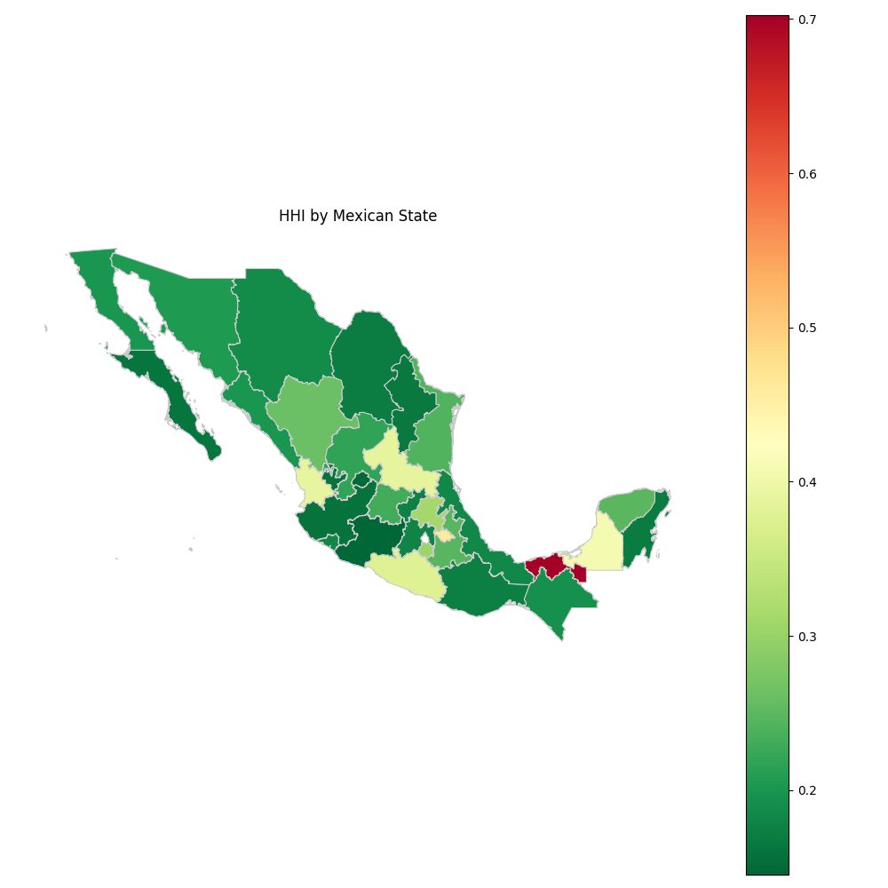

# Perfil Económico por Estado

Con el objetivo de poner en práctica un poco de Spark con datos abiertos del INEGI, se desarrolló un breve proyecto que busca realizar un perfil económico para cada estado de la República Mexicana.

El objetivo es simple: utilizar el conjunto de datos del Censo Económico de 2019 (el más reciente hasta la fecha), disponible en [https://www.inegi.org.mx/datosabiertos/](https://www.inegi.org.mx/datosabiertos/), y con él obtener dos métricas sencillas:

- **Top 5 de actividades económicas más importantes por estado**  
- **La contribución de la principal actividad al total de la actividad económica de cada estado**, como una métrica inversa de diversificación económica.

Los resultados para cada estado se muestran a continuación.



La segunda métrica, es decir, la contribución de la principal actividad económica al total de la actividad económica de cada estado, se muestra en el siguiente mapa.

---

### Notas

Dado que el conjunto de datos contiene un gran número de registros a diferentes niveles de granularidad, se utilizó un criterio sencillo para seleccionar valores que reflejaran la actividad económica de cada estado de manera general. Sin embargo, un análisis más detallado podría utilizar más variables.